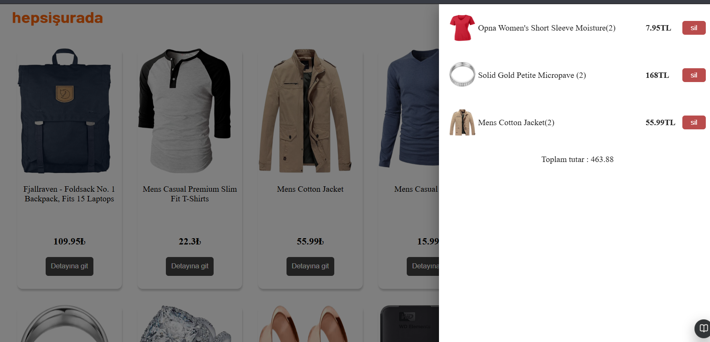
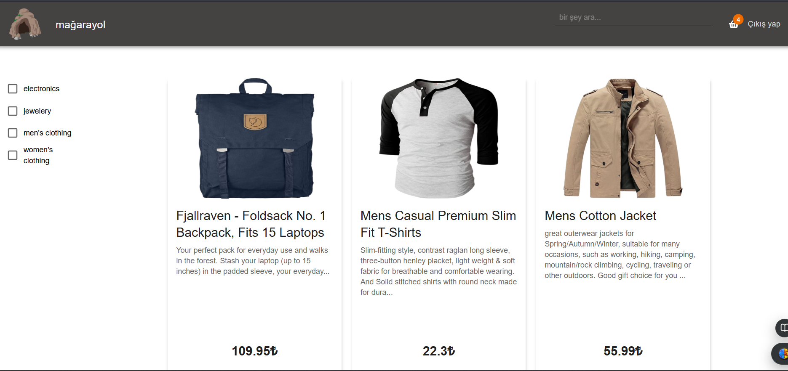
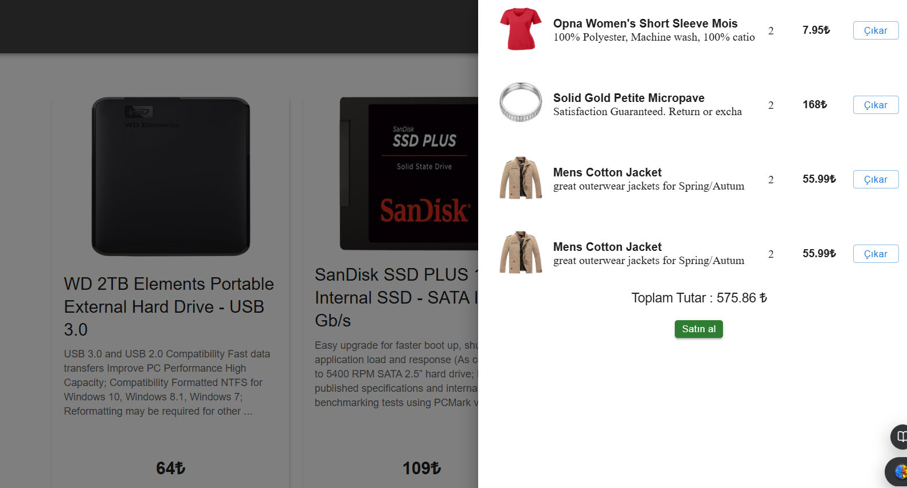
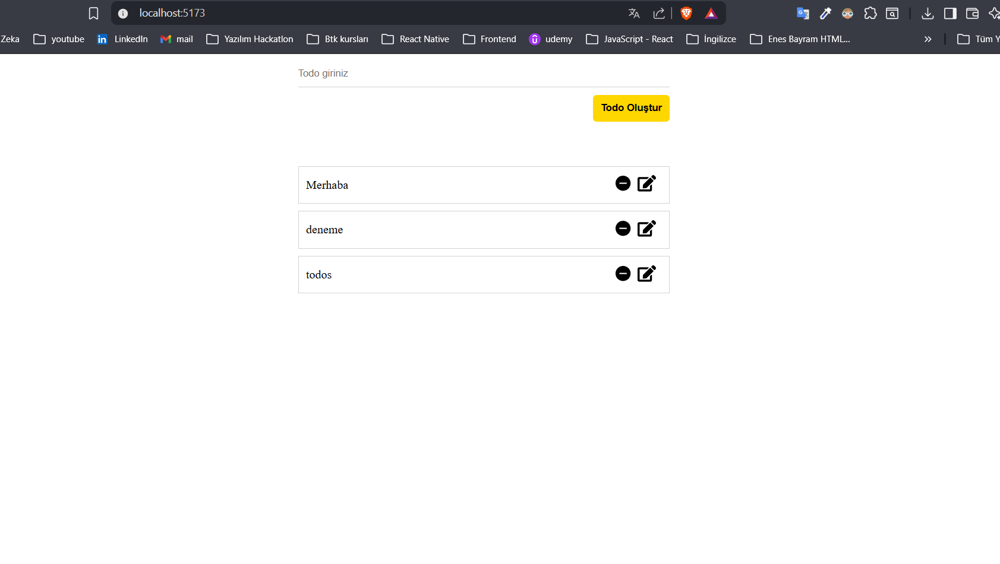
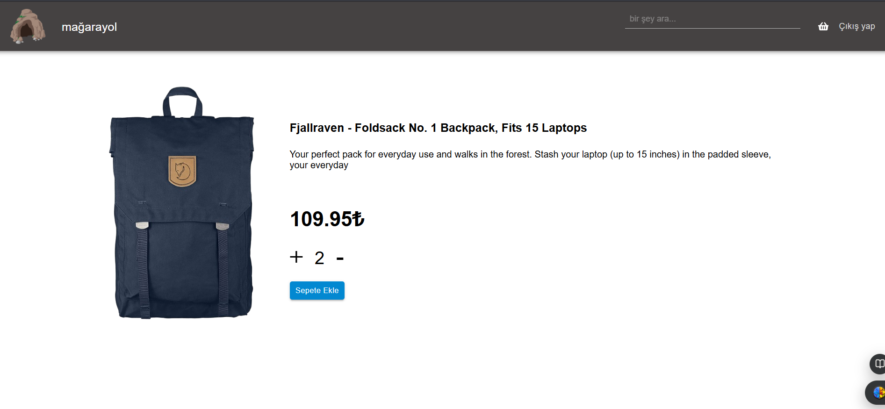
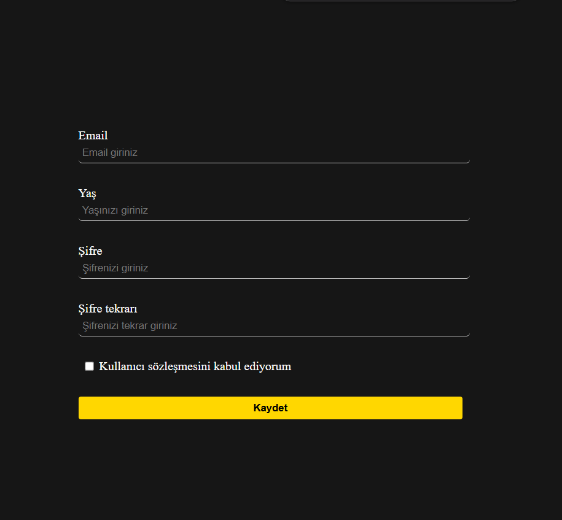

# ⚛️ React Geliştirme Eğitimi

Bu repo, **Enes Bayram** tarafından hazırlanan [▶️ Enes Bayram - React Kursu](https://www.udemy.com/course/sfrdan-ileriye-seviye-react-kursu-guncel-egitim-2024/) eğitimini tamamladığım süreçte yazdığım ders notlarını ve proje kodlarını içermektedir.

---

## 📚 İçerik

| Klasör | Konu |
|--------|------|
| 📁 1-giris | React'a Giriş, Kurulum |
| 📁 2-component-yapisi | Component Yapısı |
| 📁 3-props | Props Kullanımı |
| 📁 4-use-state | useState Hook |
| 📁 5-use-effect | useEffect Hook |
| 📁 6-debugging | Debugging Teknikleri |
| 📁 7-kurslarim | Kurslar Uygulaması |
| 📁 8-API-using | API Kullanımı |
| 📁 8-API-using-tekrarı | API Kullanımı Tekrar |
| 📁 9-döviz-kuru-uygulamasi-front | Döviz Kuru - Frontend |
| 📁 10-döviz-kuru-uygulamasi-back | Döviz Kuru - Backend |
| 📁 11-ToDo | Todo Uygulaması |
| 📁 12-redux | Redux State Yönetimi |
| 📁 13-Router-Dom | React Router Dom |
| 📁 13-Router-useNavigate-useParams | useNavigate & useParams |
| 📁 14-hepsiSurada | HepsiSurada E-Ticaret Projesi |
| 📁 15-todo-app-ts | Todo App - TypeScript |
| 📁 16-custom-hook | Custom Hook |
| 📁 17-formik-yup | Form Yönetimi (Formik & Yup) |
| 📁 18-material-UI | Material UI Bileşenleri |
| 📁 19-firebase | Firebase Entegrasyonu |
| 📁 20-firebase-tekrar | Firebase Tekrar |
| 📁 21-final-proje | Final Proje |
| 📁 22-final-proje-tekrar | Final Proje Tekrar |

---

## 🚀 Projeler

### 🛒 HepsiSurada - E-Ticaret Uygulaması
Fake Store API kullanan tam kapsamlı e-ticaret uygulaması. Ürün listeleme, arama, kategori filtreleme, ürün detay sayfası ve sepet yönetimi özellikleri içerir.

---

### 🏪 Mağarayol - Final E-Ticaret Projesi
Firebase destekli, kullanıcı girişi olan gelişmiş e-ticaret uygulaması. Kategori filtreleme, sepet yönetimi ve kullanıcı kimlik doğrulama içerir.

---

### 💱 Döviz Kuru Uygulaması
API entegrasyonlu, gerçek zamanlı döviz çeviri uygulaması. React frontend + backend mimarisi ile geliştirildi.

---

### ✅ Todo Uygulaması
Görev ekleme, silme ve düzenleme özellikli yapılacaklar listesi. Redux ile state yönetimi, TypeScript ile tip güvenliği sağlandı.

---

### 🗺️ Router Dom - Ürün Listeleme
React Router Dom ile çok sayfalı ürün listeleme ve detay sayfası uygulaması.

---

### 📝 Formik & Yup - Kayıt Formu
Formik ve Yup kütüphaneleri ile form validasyonu yapılan kayıt formu uygulaması.

---

## 🛠️ Kullanılan Teknolojiler

---

## 📖 Öğrenilen Konular

### React Temelleri
- Component yapısı ve JSX
- Props ile veri aktarımı
- useState ve useEffect Hook'ları
- Custom Hook yazımı
- Debugging teknikleri

### State Yönetimi
- Redux ile global state yönetimi
- Redux Toolkit

### Routing
- React Router Dom
- useNavigate ve useParams hook'ları
- Çok sayfalı uygulama yapısı

### API & Asenkron İşlemler
- REST API entegrasyonu
- Fetch ve Axios kullanımı
- Backend ile iletişim

### Form Yönetimi
- Formik ile form yönetimi
- Yup ile form validasyonu

### UI Kütüphaneleri
- Material UI bileşenleri
- Responsive tasarım

### TypeScript
- TypeScript ile React
- Tip tanımlamaları

### Firebase
- Firebase Authentication
- Firestore veritabanı
- Gerçek zamanlı veri

---

## 📺 Kurs Linki

[▶️ Enes Bayram - React Kursu](https://www.youtube.com/playlist?list=PLURN6mxdcwL-xIXzq92ZJN9yRW7Q0mjzw)

---

## 👨‍💻 Geliştirici

**Mehmet Mahmut Burkay**  

